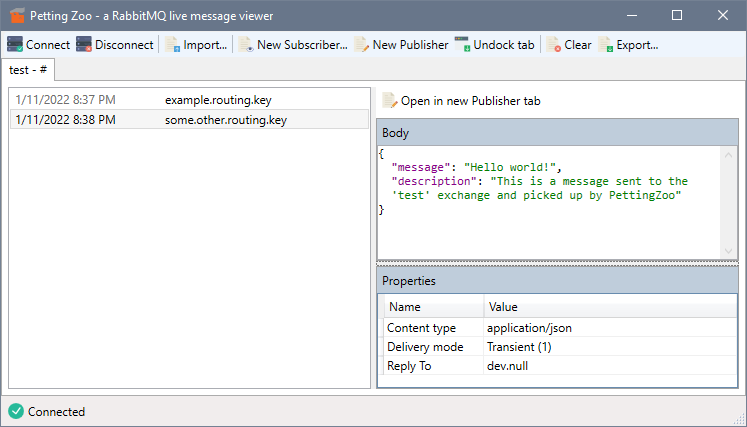
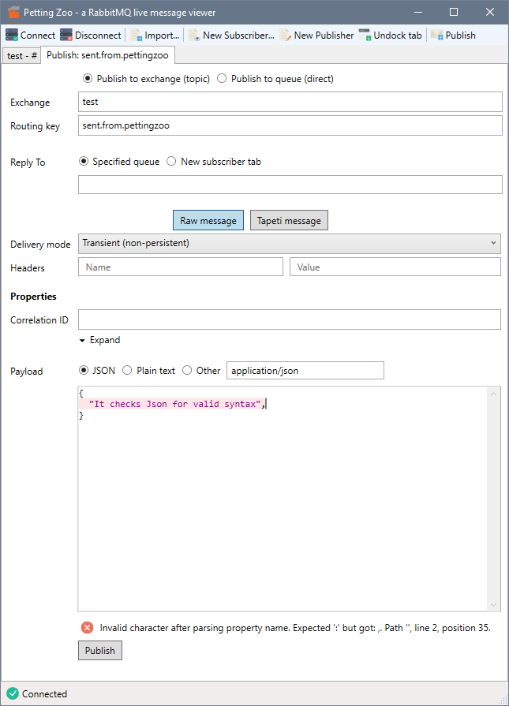
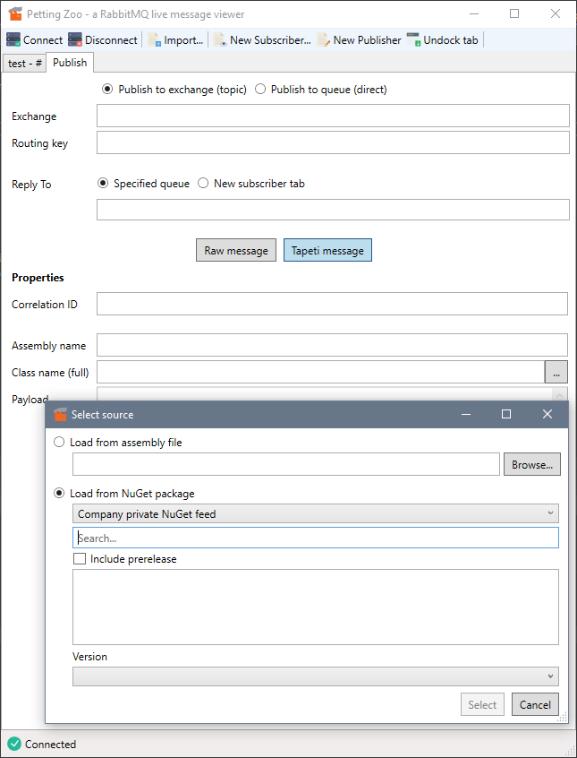

#  Petting Zoo
##### A RabbitMQ live message viewer (and publisher)

PettingZoo provides a desktop interface for subscribing and publishing to RabbitMQ. It is a useful tool in debugging, allowing you to monitor the flow of messages in a running system and replay those messages if required.

PettingZoo requires .NET 6 to run.

## Features

 1. Subscribe to one or more exchanges with specified routing keys to inspect published messages
 2. Publish new messages to an exchange or to a specific queue
 3. JSON syntax highlighting and validation
 4. Support for publishing and validating [Tapeti](https://github.com/MvRens/Tapeti) messages from assembly files or directly from (private) NuGet feeds
 5. Support for exporting and importing [Tapeti.Cmd](https://github.com/MvRens/Tapeti.Cmd) compatible single-file JSON

## Builds
Builds are automatically run using AppVeyor. Release versions are available as a [GitHub release](https://github.com/MvRens/PettingZoo/releases) and include a ZIP file containing the executable and required files.

Extract the ZIP file and run PettingZoo.exe to get started.

The source code is compiled using Visual Studio 2022.

Master build (stable release)

Latest build

## Screenshots
##### Subscribing to messages

##### Publishing a message

##### Publishing a message from a Tapeti-compatible assembly

## Credits
#### Icons

Toolbar icons are from the (now defunct) Interaction Assets pack by Madebyoliver
<http://www.flaticon.com/authors/madebyoliver>

Designed by Freepik and distributed by Flaticon